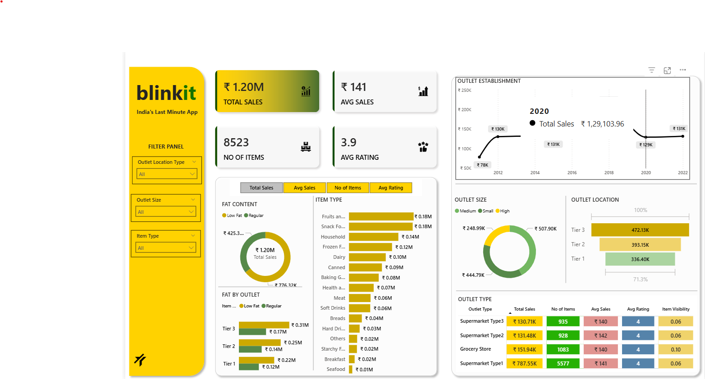

# 🛒 Blinkit Sales Dashboard — Power BI

## 📌 Overview
An interactive Power BI dashboard built on Blinkit's grocery sales data to analyze outlet performance, product trends, and key business KPIs. Designed to support data-driven retail decisions.

---

## 🛠️ Tools & Technologies


---

## 🎯 Objectives
- Track Total Sales, Average Sales, Number of Items, and Average Rating
- Analyze sales performance by outlet type, size, and location tier
- Identify top-performing product categories and fat content preferences
- Visualize outlet establishment growth over the years

---

## 📊 Dashboard Preview



---

## 📊 Key Insights
- Compared sales performance across Tier 1, Tier 2, and Tier 3 outlet locations
- Identified top item categories contributing to maximum revenue
- Analyzed how outlet size impacts total sales and customer ratings

---

## 📁 Project Structure
```
Blinkit-Dashboard/
│
├── Blinkit Grocery Data.xlsx   # Raw dataset
├── Blinkit.pbix                # Power BI dashboard file
├── Dashboard.png               # Dashboard screenshot
└── README.md
```

---

## 🚀 How to View
1. Clone the repository: `git clone https://github.com/KailasH1245/Blinkit-Dashboard`
2. Open `Blinkit.pbix` in Power BI Desktop
3. Explore the interactive dashboard!

---

## 👤 Author
**Kailash Choudhary** | [LinkedIn](https://www.linkedin.com/in/kailashchoudharydata/) | [GitHub](https://github.com/KailasH1245)
